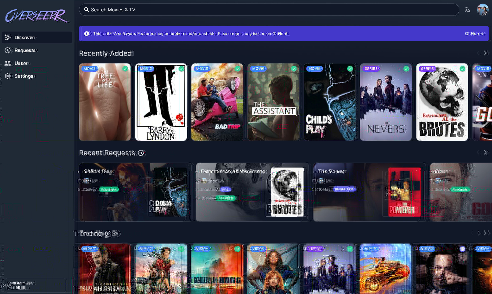

<!-- ALL-CONTRIBUTORS-BADGE:START - Do not remove or modify this section -->

<!-- ALL-CONTRIBUTORS-BADGE:END -->

**Overseerr** is a free and open source software application for managing requests for your media library. It integrates with your existing services, such as **[Sonarr](https://sonarr.tv/)**, **[Radarr](https://radarr.video/)**, and **[Plex](https://www.plex.tv/)**!

## Current Features

- Full Plex integration. Authenticate and manage user access with Plex!
- Easy integration with your existing services. Currently, Overseerr supports Sonarr and Radarr. More to come!
- Plex library scan, to keep track of the titles which are already available.
- Customizable request system, which allows users to request individual seasons or movies in a friendly, easy-to-use interface.
- Incredibly simple request management UI. Don't dig through the app to simply approve recent requests!
- Granular permission system.
- Support for various notification agents.
- Mobile-friendly design, for when you need to approve requests on the go!

With more features on the way! Check out our [issue tracker](https://github.com/sct/overseerr/issues) to see the features which have already been requested.

## Getting Started

Check out our documentation for instructions on how to install and run Overseerr:

https://docs.overseerr.dev/getting-started/installation

## Preview

## Support

- Check out the [Overseerr Documentation](https://docs.overseerr.dev/) before asking for help. Your question might already be in the [FAQ](https://docs.overseerr.dev/support/faq).
- You can get support on [Discord](https://discord.gg/overseerr).
- You can ask questions in the Help category of our [GitHub Discussions](https://github.com/sct/overseerr/discussions).
- Bug reports and feature requests can be submitted via [GitHub Issues](https://github.com/sct/overseerr/issues).

## API Documentation

Our documentation is built on every commit and hosted at https://api-docs.overseerr.dev

You can also access the API documentation from your local Overseerr install at http://localhost:5055/api-docs

## Community

You can ask questions, share ideas, and more in [GitHub Discussions](https://github.com/sct/overseerr/discussions).

If you would like to chat with other members of our growing community, [join the Overseerr Discord server](https://discord.gg/overseerr)!

Our [Code of Conduct](https://github.com/sct/overseerr/blob/develop/CODE_OF_CONDUCT.md) applies to all Overseerr community channels.

## Contributing

You can help improve Overseerr too! Check out our [Contribution Guide](https://github.com/sct/overseerr/blob/develop/CONTRIBUTING.md) to get started.

## Contributors ✨

Thanks goes to these wonderful people ([emoji key](https://allcontributors.org/docs/en/emoji-key)):

<!-- ALL-CONTRIBUTORS-LIST:START - Do not remove or modify this section -->
<!-- prettier-ignore-start -->
<!-- markdownlint-disable -->
<table>
  <tbody>
    <tr>
      <td align="center" valign="top" width="14.28%"><a href="https://sct.dev"> <b>sct</b></a> <a href="https://github.com/sct/overseerr/commits?author=sct" title="Code">💻</a> <a href="#design-sct" title="Design">🎨</a> <a href="#ideas-sct" title="Ideas, Planning, & Feedback">🤔</a></td>
      <td align="center" valign="top" width="14.28%"><a href="https://github.com/azoitos"> <b>Alex Zoitos</b></a> <a href="https://github.com/sct/overseerr/commits?author=azoitos" title="Code">💻</a></td>
      <td align="center" valign="top" width="14.28%"><a href="https://github.com/OwsleyJr"> <b>Brandon Cohen</b></a> <a href="https://github.com/sct/overseerr/commits?author=OwsleyJr" title="Code">💻</a> <a href="https://github.com/sct/overseerr/commits?author=OwsleyJr" title="Documentation">📖</a></td>
      <td align="center" valign="top" width="14.28%"><a href="https://github.com/Ahreluth"> <b>Ahreluth</b></a> <a href="#translation-Ahreluth" title="Translation">🌍</a></td>
      <td align="center" valign="top" width="14.28%"><a href="https://github.com/KovalevArtem"> <b>KovalevArtem</b></a> <a href="#translation-KovalevArtem" title="Translation">🌍</a></td>
      <td align="center" valign="top" width="14.28%"><a href="https://github.com/GiyomuWeb"> <b>GiyomuWeb</b></a> <a href="#translation-GiyomuWeb" title="Translation">🌍</a></td>
      <td align="center" valign="top" width="14.28%"><a href="https://github.com/angrycuban13"> <b>Angry Cuban</b></a> <a href="https://github.com/sct/overseerr/commits?author=angrycuban13" title="Documentation">📖</a></td>
    </tr>
    <tr>
      <td align="center" valign="top" width="14.28%"><a href="https://github.com/jvennik"> <b>jvennik</b></a> <a href="#translation-jvennik" title="Translation">🌍</a></td>
      <td align="center" valign="top" width="14.28%"><a href="https://github.com/darknessgp"> <b>darknessgp</b></a> <a href="https://github.com/sct/overseerr/commits?author=darknessgp" title="Code">💻</a></td>
      <td align="center" valign="top" width="14.28%"><a href="https://github.com/saltydk"> <b>salty</b></a> <a href="#infra-saltydk" title="Infrastructure (Hosting, Build-Tools, etc)">🚇</a></td>
      <td align="center" valign="top" width="14.28%"><a href="https://github.com/Shutruk"> <b>Shutruk</b></a> <a href="#translation-Shutruk" title="Translation">🌍</a></td>
      <td align="center" valign="top" width="14.28%"><a href="https://github.com/krystiancharubin"> <b>Krystian Charubin</b></a> <a href="#design-krystiancharubin" title="Design">🎨</a></td>
      <td align="center" valign="top" width="14.28%"><a href="https://github.com/kieron"> <b>Kieron Boswell</b></a> <a href="https://github.com/sct/overseerr/commits?author=kieron" title="Code">💻</a></td>
      <td align="center" valign="top" width="14.28%"><a href="https://github.com/samwiseg0"> <b>samwiseg0</b></a> <a href="#question-samwiseg0" title="Answering Questions">💬</a> <a href="#infra-samwiseg0" title="Infrastructure (Hosting, Build-Tools, etc)">🚇</a></td>
    </tr>
    <tr>
      <td align="center" valign="top" width="14.28%"><a href="https://github.com/ecelebi29"> <b>ecelebi29</b></a> <a href="https://github.com/sct/overseerr/commits?author=ecelebi29" title="Code">💻</a> <a href="https://github.com/sct/overseerr/commits?author=ecelebi29" title="Documentation">📖</a></td>
      <td align="center" valign="top" width="14.28%"><a href="https://github.com/mmozeiko"> <b>Mārtiņš Možeiko</b></a> <a href="https://github.com/sct/overseerr/commits?author=mmozeiko" title="Code">💻</a></td>
      <td align="center" valign="top" width="14.28%"><a href="https://github.com/mazzetta86"> <b>mazzetta86</b></a> <a href="#translation-mazzetta86" title="Translation">🌍</a></td>
      <td align="center" valign="top" width="14.28%"><a href="https://github.com/Panzer1119"> <b>Paul Hagedorn</b></a> <a href="#translation-Panzer1119" title="Translation">🌍</a></td>
      <td align="center" valign="top" width="14.28%"><a href="https://github.com/Shagon94"> <b>Shagon94</b></a> <a href="#translation-Shagon94" title="Translation">🌍</a></td>
      <td align="center" valign="top" width="14.28%"><a href="https://github.com/sebstrgg"> <b>sebstrgg</b></a> <a href="#translation-sebstrgg" title="Translation">🌍</a></td>
      <td align="center" valign="top" width="14.28%"><a href="https://github.com/danshilm"> <b>Danshil Mungur</b></a> <a href="https://github.com/sct/overseerr/commits?author=danshilm" title="Code">💻</a> <a href="https://github.com/sct/overseerr/commits?author=danshilm" title="Documentation">📖</a></td>
    </tr>
    <tr>
      <td align="center" valign="top" width="14.28%"><a href="https://github.com/doob187"> <b>doob187</b></a> <a href="#infra-doob187" title="Infrastructure (Hosting, Build-Tools, etc)">🚇</a></td>
      <td align="center" valign="top" width="14.28%"><a href="https://github.com/johnpyp"> <b>johnpyp</b></a> <a href="https://github.com/sct/overseerr/commits?author=johnpyp" title="Code">💻</a></td>
      <td align="center" valign="top" width="14.28%"><a href="https://github.com/ankarhem"> <b>Jakob Ankarhem</b></a> <a href="https://github.com/sct/overseerr/commits?author=ankarhem" title="Documentation">📖</a> <a href="https://github.com/sct/overseerr/commits?author=ankarhem" title="Code">💻</a> <a href="#translation-ankarhem" title="Translation">🌍</a></td>
      <td align="center" valign="top" width="14.28%"><a href="https://github.com/jayesh100"> <b>Jayesh</b></a> <a href="https://github.com/sct/overseerr/commits?author=jayesh100" title="Code">💻</a></td>
      <td align="center" valign="top" width="14.28%"><a href="https://github.com/flying-sausages"> <b>flying-sausages</b></a> <a href="https://github.com/sct/overseerr/commits?author=flying-sausages" title="Documentation">📖</a></td>
      <td align="center" valign="top" width="14.28%"><a href="https://github.com/hirenshah"> <b>hirenshah</b></a> <a href="https://github.com/sct/overseerr/commits?author=hirenshah" title="Documentation">📖</a></td>
      <td align="center" valign="top" width="14.28%"><a href="https://github.com/TheCatLady"> <b>TheCatLady</b></a> <a href="https://github.com/sct/overseerr/commits?author=TheCatLady" title="Code">💻</a> <a href="#translation-TheCatLady" title="Translation">🌍</a> <a href="https://github.com/sct/overseerr/commits?author=TheCatLady" title="Documentation">📖</a></td>
    </tr>
    <tr>
      <td align="center" valign="top" width="14.28%"><a href="https://github.com/chriscpritchard"> <b>Chris Pritchard</b></a> <a href="https://github.com/sct/overseerr/commits?author=chriscpritchard" title="Code">💻</a> <a href="https://github.com/sct/overseerr/commits?author=chriscpritchard" title="Documentation">📖</a></td>
      <td align="center" valign="top" width="14.28%"><a href="https://github.com/Tamberlox"> <b>Tamberlox</b></a> <a href="#translation-Tamberlox" title="Translation">🌍</a></td>
      <td align="center" valign="top" width="14.28%"><a href="https://hmnd.io"> <b>David</b></a> <a href="https://github.com/sct/overseerr/commits?author=hmnd" title="Code">💻</a></td>
      <td align="center" valign="top" width="14.28%"><a href="https://www.douglas-parker.com"> <b>Douglas Parker</b></a> <a href="https://github.com/sct/overseerr/commits?author=douglasparker" title="Documentation">📖</a></td>
      <td align="center" valign="top" width="14.28%"><a href="https://github.com/dancarter"> <b>Daniel Carter</b></a> <a href="https://github.com/sct/overseerr/commits?author=dancarter" title="Code">💻</a></td>
      <td align="center" valign="top" width="14.28%"><a href="https://nuro.dev"> <b>nuro</b></a> <a href="https://github.com/sct/overseerr/commits?author=NuroDev" title="Documentation">📖</a></td>
      <td align="center" valign="top" width="14.28%"><a href="https://github.com/onedr0p"> <b>ᗪєνιη ᗷυнʟ</b></a> <a href="#infra-onedr0p" title="Infrastructure (Hosting, Build-Tools, etc)">🚇</a></td>
    </tr>
    <tr>
      <td align="center" valign="top" width="14.28%"><a href="https://github.com/JonnyWong16"> <b>JonnyWong16</b></a> <a href="https://github.com/sct/overseerr/commits?author=JonnyWong16" title="Documentation">📖</a></td>
      <td align="center" valign="top" width="14.28%"><a href="https://github.com/Roxedus"> <b>Roxedus</b></a> <a href="https://github.com/sct/overseerr/commits?author=Roxedus" title="Documentation">📖</a></td>
      <td align="center" valign="top" width="14.28%"><a href="https://github.com/WoisWoi"> <b>WoisWoi</b></a> <a href="#translation-WoisWoi" title="Translation">🌍</a></td>
      <td align="center" valign="top" width="14.28%"><a href="https://github.com/HubDuck"> <b>HubDuck</b></a> <a href="#translation-HubDuck" title="Translation">🌍</a> <a href="https://github.com/sct/overseerr/commits?author=HubDuck" title="Documentation">📖</a></td>
      <td align="center" valign="top" width="14.28%"><a href="https://github.com/costaht"> <b>costaht</b></a> <a href="https://github.com/sct/overseerr/commits?author=costaht" title="Documentation">📖</a> <a href="#translation-costaht" title="Translation">🌍</a></td>
      <td align="center" valign="top" width="14.28%"><a href="https://github.com/Shjosan"> <b>Shjosan</b></a> <a href="#translation-Shjosan" title="Translation">🌍</a></td>
      <td align="center" valign="top" width="14.28%"><a href="https://github.com/kobaubarr"> <b>kobaubarr</b></a> <a href="#translation-kobaubarr" title="Translation">🌍</a></td>
    </tr>
    <tr>
      <td align="center" valign="top" width="14.28%"><a href="https://github.com/notorius28"> <b>Ricardo González</b></a> <a href="#translation-notorius28" title="Translation">🌍</a></td>
      <td align="center" valign="top" width="14.28%"><a href="http://torkili.uz"> <b>Torkil</b></a> <a href="#translation-Torkiliuz" title="Translation">🌍</a></td>
      <td align="center" valign="top" width="14.28%"><a href="https://www.jagandeepbrar.io"> <b>Jagandeep Brar</b></a> <a href="https://github.com/sct/overseerr/commits?author=JagandeepBrar" title="Documentation">📖</a></td>
      <td align="center" valign="top" width="14.28%"><a href="http://dtalens.com"> <b>dtalens</b></a> <a href="#translation-dtalens" title="Translation">🌍</a></td>
      <td align="center" valign="top" width="14.28%"><a href="https://github.com/acortelyou"> <b>Alex Cortelyou</b></a> <a href="https://github.com/sct/overseerr/commits?author=acortelyou" title="Code">💻</a></td>
      <td align="center" valign="top" width="14.28%"><a href="https://nz.linkedin.com/in/jonocairns"> <b>Jono Cairns</b></a> <a href="https://github.com/sct/overseerr/commits?author=jonocairns" title="Code">💻</a></td>
      <td align="center" valign="top" width="14.28%"><a href="https://scias.net/"> <b>DJScias</b></a> <a href="#translation-DJScias" title="Translation">🌍</a></td>
    </tr>
    <tr>
      <td align="center" valign="top" width="14.28%"><a href="https://github.com/Dabu-dot"> <b>Dabu-dot</b></a> <a href="#translation-Dabu-dot" title="Translation">🌍</a></td>
      <td align="center" valign="top" width="14.28%"><a href="https://github.com/Jabster28"> <b>Jabster28</b></a> <a href="https://github.com/sct/overseerr/commits?author=Jabster28" title="Code">💻</a></td>
      <td align="center" valign="top" width="14.28%"><a href="https://github.com/littlerooster"> <b>littlerooster</b></a> <a href="#translation-littlerooster" title="Translation">🌍</a></td>
      <td align="center" valign="top" width="14.28%"><a href="https://github.com/dphildebrandt"> <b>Dustin Hildebrandt</b></a> <a href="https://github.com/sct/overseerr/commits?author=dphildebrandt" title="Code">💻</a></td>
      <td align="center" valign="top" width="14.28%"><a href="https://github.com/Generator"> <b>Bruno Guerreiro</b></a> <a href="#translation-Generator" title="Translation">🌍</a></td>
      <td align="center" valign="top" width="14.28%"><a href="https://github.com/iceHtwoO"> <b>Alexander Neuhäuser</b></a> <a href="#translation-iceHtwoO" title="Translation">🌍</a></td>
      <td align="center" valign="top" width="14.28%"><a href="http://www.unext.co.jp"> <b>Livio</b></a> <a href="#design-liviokanone" title="Design">🎨</a></td>
    </tr>
    <tr>
      <td align="center" valign="top" width="14.28%"><a href="https://github.com/tangentThought"> <b>tangentThought</b></a> <a href="https://github.com/sct/overseerr/commits?author=tangentThought" title="Code">💻</a></td>
      <td align="center" valign="top" width="14.28%"><a href="https://github.com/nicospz"> <b>Nicolás Espinoza</b></a> <a href="https://github.com/sct/overseerr/commits?author=nicospz" title="Code">💻</a></td>
      <td align="center" valign="top" width="14.28%"><a href="https://github.com/sootylunatic"> <b>sootylunatic</b></a> <a href="#translation-sootylunatic" title="Translation">🌍</a></td>
      <td align="center" valign="top" width="14.28%"><a href="https://github.com/JoKerIsCraZy"> <b>JoKerIsCraZy</b></a> <a href="#translation-JoKerIsCraZy" title="Translation">🌍</a></td>
      <td align="center" valign="top" width="14.28%"><a href="https://daddie.dev"> <b>Daddie0</b></a> <a href="#translation-GoByeBye" title="Translation">🌍</a></td>
      <td align="center" valign="top" width="14.28%"><a href="http://ungaro.me"> <b>Simone</b></a> <a href="#translation-Simoneu01" title="Translation">🌍</a></td>
      <td align="center" valign="top" width="14.28%"><a href="https://github.com/adan89lion"> <b>Seohyun Joo</b></a> <a href="#translation-adan89lion" title="Translation">🌍</a></td>
    </tr>
    <tr>
      <td align="center" valign="top" width="14.28%"><a href="https://github.com/ty4ko"> <b>Sergey</b></a> <a href="#translation-ty4ko" title="Translation">🌍</a></td>
      <td align="center" valign="top" width="14.28%"><a href="https://github.com/skafte1990"> <b>Shaaft</b></a> <a href="#translation-skafte1990" title="Translation">🌍</a></td>
      <td align="center" valign="top" width="14.28%"><a href="https://github.com/sr093906"> <b>sr093906</b></a> <a href="#translation-sr093906" title="Translation">🌍</a></td>
      <td align="center" valign="top" width="14.28%"><a href="https://github.com/Nackophilz"> <b>Nackophilz</b></a> <a href="#translation-Nackophilz" title="Translation">🌍</a></td>
      <td align="center" valign="top" width="14.28%"><a href="https://github.com/schambers"> <b>Sean Chambers</b></a> <a href="https://github.com/sct/overseerr/commits?author=schambers" title="Code">💻</a></td>
      <td align="center" valign="top" width="14.28%"><a href="https://github.com/deniscerri"> <b>deniscerri</b></a> <a href="#translation-deniscerri" title="Translation">🌍</a></td>
      <td align="center" valign="top" width="14.28%"><a href="https://github.com/tomgacz"> <b>tomgacz</b></a> <a href="#translation-tomgacz" title="Translation">🌍</a></td>
    </tr>
    <tr>
      <td align="center" valign="top" width="14.28%"><a href="https://github.com/Andersborrits"> <b>Andersborrits</b></a> <a href="#translation-Andersborrits" title="Translation">🌍</a></td>
      <td align="center" valign="top" width="14.28%"><a href="http://maxentrouault.fr"> <b>Maxent</b></a> <a href="#translation-Maxentr" title="Translation">🌍</a></td>
      <td align="center" valign="top" width="14.28%"><a href="https://github.com/sambartik"> <b>Samuel Bartík</b></a> <a href="https://github.com/sct/overseerr/commits?author=sambartik" title="Code">💻</a></td>
      <td align="center" valign="top" width="14.28%"><a href="https://github.com/frank-cywong"> <b>Chun Yeung Wong</b></a> <a href="https://github.com/sct/overseerr/commits?author=frank-cywong" title="Code">💻</a></td>
      <td align="center" valign="top" width="14.28%"><a href="https://github.com/TheMeanCanEHdian"> <b>TheMeanCanEHdian</b></a> <a href="https://github.com/sct/overseerr/commits?author=TheMeanCanEHdian" title="Code">💻</a></td>
      <td align="center" valign="top" width="14.28%"><a href="https://github.com/Gylesie"> <b>Gylesie</b></a> <a href="https://github.com/sct/overseerr/commits?author=Gylesie" title="Code">💻</a></td>
      <td align="center" valign="top" width="14.28%"><a href="https://github.com/Fhd-pro"> <b>Fhd-pro</b></a> <a href="#translation-Fhd-pro" title="Translation">🌍</a></td>
    </tr>
    <tr>
      <td align="center" valign="top" width="14.28%"><a href="https://github.com/PovilasID"> <b>PovilasID</b></a> <a href="#translation-PovilasID" title="Translation">🌍</a></td>
      <td align="center" valign="top" width="14.28%"><a href="https://github.com/byakurau"> <b>byakurau</b></a> <a href="#translation-byakurau" title="Translation">🌍</a></td>
      <td align="center" valign="top" width="14.28%"><a href="https://github.com/miknii"> <b>miknii</b></a> <a href="#translation-miknii" title="Translation">🌍</a></td>
      <td align="center" valign="top" width="14.28%"><a href="https://github.com/Eclipseop"> <b>Mackenzie</b></a> <a href="https://github.com/sct/overseerr/commits?author=Eclipseop" title="Code">💻</a></td>
      <td align="center" valign="top" width="14.28%"><a href="https://github.com/s0up4200"> <b>soup</b></a> <a href="https://github.com/sct/overseerr/commits?author=s0up4200" title="Documentation">📖</a></td>
      <td align="center" valign="top" width="14.28%"><a href="https://github.com/ceptonit"> <b>ceptonit</b></a> <a href="https://github.com/sct/overseerr/commits?author=ceptonit" title="Documentation">📖</a></td>
      <td align="center" valign="top" width="14.28%"><a href="https://github.com/aedelbro"> <b>aedelbro</b></a> <a href="https://github.com/sct/overseerr/commits?author=aedelbro" title="Code">💻</a></td>
    </tr>
    <tr>
      <td align="center" valign="top" width="14.28%"><a href="http://twitter.com/lunks/"> <b>Pedro Nascimento</b></a> <a href="https://github.com/sct/overseerr/commits?author=lunks" title="Code">💻</a></td>
      <td align="center" valign="top" width="14.28%"><a href="https://voke.dev"> <b>Owen Voke</b></a> <a href="https://github.com/sct/overseerr/commits?author=owenvoke" title="Code">💻</a></td>
      <td align="center" valign="top" width="14.28%"><a href="https://github.com/Nimelrian"> <b>Sebastian K</b></a> <a href="https://github.com/sct/overseerr/commits?author=Nimelrian" title="Code">💻</a></td>
      <td align="center" valign="top" width="14.28%"><a href="https://github.com/jariz"> <b>jariz</b></a> <a href="https://github.com/sct/overseerr/commits?author=jariz" title="Code">💻</a></td>
      <td align="center" valign="top" width="14.28%"><a href="https://arouillard.fr"> <b>Alex</b></a> <a href="https://github.com/sct/overseerr/commits?author=Alexays" title="Code">💻</a></td>
      <td align="center" valign="top" width="14.28%"><a href="https://github.com/Zebebles"> <b>Zeb Muller</b></a> <a href="https://github.com/sct/overseerr/commits?author=Zebebles" title="Code">💻</a></td>
      <td align="center" valign="top" width="14.28%"><a href="http://smoores.dev"> <b>Shane Friedman</b></a> <a href="https://github.com/sct/overseerr/commits?author=SMores" title="Code">💻</a></td>
    </tr>
    <tr>
      <td align="center" valign="top" width="14.28%"><a href="https://izaacj.me"> <b>Izaac Brånn</b></a> <a href="https://github.com/sct/overseerr/commits?author=IzaacJ" title="Code">💻</a></td>
      <td align="center" valign="top" width="14.28%"><a href="https://github.com/SalmanTariq"> <b>Salman Tariq</b></a> <a href="https://github.com/sct/overseerr/commits?author=SalmanTariq" title="Code">💻</a></td>
      <td align="center" valign="top" width="14.28%"><a href="https://github.com/andrew-kennedy"> <b>Andrew Kennedy</b></a> <a href="https://github.com/sct/overseerr/commits?author=andrew-kennedy" title="Code">💻</a></td>
      <td align="center" valign="top" width="14.28%"><a href="https://github.com/Fallenbagel"> <b>Fallenbagel</b></a> <a href="https://github.com/sct/overseerr/commits?author=Fallenbagel" title="Code">💻</a></td>
      <td align="center" valign="top" width="14.28%"><a href="http://aidoge.xyz"> <b>Anton K. (ai Doge)</b></a> <a href="https://github.com/sct/overseerr/commits?author=scorp200" title="Code">💻</a></td>
      <td align="center" valign="top" width="14.28%"><a href="https://marcofaggian.com"> <b>Marco Faggian</b></a> <a href="https://github.com/sct/overseerr/commits?author=marcofaggian" title="Code">💻</a></td>
    </tr>
  </tbody>
</table>

<!-- markdownlint-restore -->
<!-- prettier-ignore-end -->

<!-- ALL-CONTRIBUTORS-LIST:END -->
