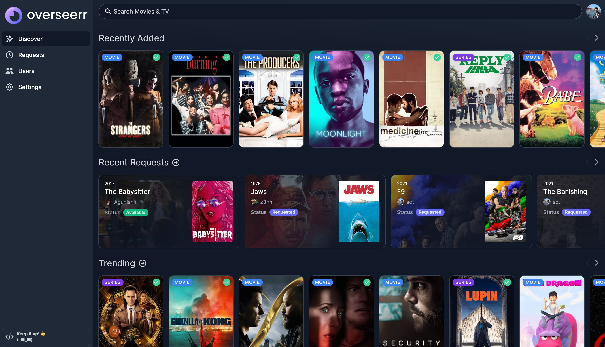

<p align="center">

</p>
<p align="center">


</p>
<p align="center">
<a href="https://discord.gg/PkCWJSeCk7"></a>
<a href="https://hub.docker.com/r/sctx/overseerr"></a>
<a href="https://hosted.weblate.org/engage/overseerr/"></a>
<a href="https://lgtm.com/projects/g/sct/overseerr/context:javascript"></a>
<a href="https://github.com/sct/overseerr/blob/develop/LICENSE"></a>
<!-- ALL-CONTRIBUTORS-BADGE:START - Do not remove or modify this section -->
<a href="#contributors-"></a>
<!-- ALL-CONTRIBUTORS-BADGE:END -->
</p>

**Overseerr** is a free and open source software application for managing requests for your media library. It integrates with your existing services, such as **[Sonarr](https://sonarr.tv/)**, **[Radarr](https://radarr.video/)**, and **[Plex](https://www.plex.tv/)**!

## Current Features

- Full Plex integration. Authenticate and manage user access with Plex!
- Easy integration with your existing services. Currently, Overseerr supports Sonarr and Radarr. More to come!
- Plex library sync, to keep track of the titles which are already available.
- Customizable request system, which allows users to request individual seasons or movies in a friendly, easy-to-use interface.
- Incredibly simple request management UI. Don't dig through the app to simply approve recent requests!
- Granular permission system.
- Support for various notification agents.
- Mobile-friendly design, for when you need to approve requests on the go!

## Planned Features

- Additional notification types.
- Issues system. This will allow users to report issues with content on your media server.
- And a ton more! Check out our [issue tracker](https://github.com/sct/overseerr/issues) to see the features which have already been requested.

## Getting Started

Check out our documentation for instructions on how to install and run Overseerr:

https://docs.overseerr.dev/getting-started/installation

## Running Overseerr

Currently, Overseerr is primarily distributed as Docker images. If you have Docker installed, you can simply run Overseerr with:

```
docker run -d \
  --name overseerr \
  -e LOG_LEVEL=info \
  -e TZ=Asia/Tokyo \
  -p 5055:5055 \
  -v /path/to/appdata/config:/app/config \
  --restart unless-stopped \
  sctx/overseerr
```

After running Overseerr for the first time, configure it by visiting the web UI at http://[address]:5055 and completing the setup steps

For more information or alternative installation methods, please see the [Overseerr documentation](https://docs.overseerr.dev/getting-started/installation).

⚠️ Overseerr is currently under very heavy, rapid development and things are likely to break often. We need all the help we can get to find bugs and get them fixed to hit a more stable release. If you would like to help test the bleeding edge, please use the `sctx/overseerr:develop` image instead! ⚠️

## Preview



## Support

- Check out the [Overseerr Documentation](https://docs.overseerr.dev/) before asking for help. Your question might already be in the [FAQ](https://docs.overseerr.dev/support/faq).
- You can get support on [Discord](https://discord.gg/PkCWJSeCk7).
- You can ask questions in the Help category of our [GitHub Discussions](https://github.com/sct/overseerr/discussions).
- Bug reports and feature requests can be submitted via [GitHub Issues](https://github.com/sct/overseerr/issues).

## API Documentation

Our documentation is built on every commit and hosted at https://api-docs.overseerr.dev

You can also access the API documentation from your local Overseerr install at http://localhost:5055/api-docs

## Community

You can ask questions, share ideas, and more in [GitHub Discussions](https://github.com/sct/overseerr/discussions).

If you would like to chat with other members of our growing community, [join the Overseerr Discord server](https://discord.gg/PkCWJSeCk7)!

Our [Code of Conduct](https://github.com/sct/overseerr/blob/develop/CODE_OF_CONDUCT.md) applies to all Overseerr community channels.

## Contributing

You can help improve Overseerr too! Check out our [Contribution Guide](https://github.com/sct/overseerr/blob/develop/CONTRIBUTING.md) to get started.

## Contributors ✨

Thanks goes to these wonderful people ([emoji key](https://allcontributors.org/docs/en/emoji-key)):

<!-- ALL-CONTRIBUTORS-LIST:START - Do not remove or modify this section -->
<!-- prettier-ignore-start -->
<!-- markdownlint-disable -->
<table>
  <tr>
    <td align="center"><a href="https://sct.dev"><br /><sub><b>sct</b></sub></a><br /><a href="https://github.com/sct/overseerr/commits?author=sct" title="Code">💻</a> <a href="#design-sct" title="Design">🎨</a> <a href="#ideas-sct" title="Ideas, Planning, & Feedback">🤔</a></td>
    <td align="center"><a href="https://github.com/azoitos"><br /><sub><b>Alex Zoitos</b></sub></a><br /><a href="https://github.com/sct/overseerr/commits?author=azoitos" title="Code">💻</a></td>
    <td align="center"><a href="https://github.com/OwsleyJr"><br /><sub><b>Brandon Cohen</b></sub></a><br /><a href="https://github.com/sct/overseerr/commits?author=OwsleyJr" title="Code">💻</a> <a href="https://github.com/sct/overseerr/commits?author=OwsleyJr" title="Documentation">📖</a></td>
    <td align="center"><a href="https://github.com/Ahreluth"><br /><sub><b>Ahreluth</b></sub></a><br /><a href="#translation-Ahreluth" title="Translation">🌍</a></td>
    <td align="center"><a href="https://github.com/KovalevArtem"><br /><sub><b>KovalevArtem</b></sub></a><br /><a href="#translation-KovalevArtem" title="Translation">🌍</a></td>
    <td align="center"><a href="https://github.com/GiyomuWeb"><br /><sub><b>GiyomuWeb</b></sub></a><br /><a href="#translation-GiyomuWeb" title="Translation">🌍</a></td>
    <td align="center"><a href="https://github.com/angrycuban13"><br /><sub><b>Angry Cuban</b></sub></a><br /><a href="https://github.com/sct/overseerr/commits?author=angrycuban13" title="Documentation">📖</a></td>
  </tr>
  <tr>
    <td align="center"><a href="https://github.com/jvennik"><br /><sub><b>jvennik</b></sub></a><br /><a href="#translation-jvennik" title="Translation">🌍</a></td>
    <td align="center"><a href="https://github.com/darknessgp"><br /><sub><b>darknessgp</b></sub></a><br /><a href="https://github.com/sct/overseerr/commits?author=darknessgp" title="Code">💻</a></td>
    <td align="center"><a href="https://github.com/saltydk"><br /><sub><b>salty</b></sub></a><br /><a href="#infra-saltydk" title="Infrastructure (Hosting, Build-Tools, etc)">🚇</a></td>
    <td align="center"><a href="https://github.com/Shutruk"><br /><sub><b>Shutruk</b></sub></a><br /><a href="#translation-Shutruk" title="Translation">🌍</a></td>
    <td align="center"><a href="https://github.com/krystiancharubin"><br /><sub><b>Krystian Charubin</b></sub></a><br /><a href="#design-krystiancharubin" title="Design">🎨</a></td>
    <td align="center"><a href="https://github.com/kieron"><br /><sub><b>Kieron Boswell</b></sub></a><br /><a href="https://github.com/sct/overseerr/commits?author=kieron" title="Code">💻</a></td>
    <td align="center"><a href="https://github.com/samwiseg0"><br /><sub><b>samwiseg0</b></sub></a><br /><a href="#question-samwiseg0" title="Answering Questions">💬</a> <a href="#infra-samwiseg0" title="Infrastructure (Hosting, Build-Tools, etc)">🚇</a></td>
  </tr>
  <tr>
    <td align="center"><a href="https://github.com/ecelebi29"><br /><sub><b>ecelebi29</b></sub></a><br /><a href="https://github.com/sct/overseerr/commits?author=ecelebi29" title="Code">💻</a> <a href="https://github.com/sct/overseerr/commits?author=ecelebi29" title="Documentation">📖</a></td>
    <td align="center"><a href="https://github.com/mmozeiko"><br /><sub><b>Mārtiņš Možeiko</b></sub></a><br /><a href="https://github.com/sct/overseerr/commits?author=mmozeiko" title="Code">💻</a></td>
    <td align="center"><a href="https://github.com/mazzetta86"><br /><sub><b>mazzetta86</b></sub></a><br /><a href="#translation-mazzetta86" title="Translation">🌍</a></td>
    <td align="center"><a href="https://github.com/Panzer1119"><br /><sub><b>Paul Hagedorn</b></sub></a><br /><a href="#translation-Panzer1119" title="Translation">🌍</a></td>
    <td align="center"><a href="https://github.com/Shagon94"><br /><sub><b>Shagon94</b></sub></a><br /><a href="#translation-Shagon94" title="Translation">🌍</a></td>
    <td align="center"><a href="https://github.com/sebstrgg"><br /><sub><b>sebstrgg</b></sub></a><br /><a href="#translation-sebstrgg" title="Translation">🌍</a></td>
    <td align="center"><a href="https://github.com/danshilm"><br /><sub><b>Danshil Mungur</b></sub></a><br /><a href="https://github.com/sct/overseerr/commits?author=danshilm" title="Code">💻</a> <a href="https://github.com/sct/overseerr/commits?author=danshilm" title="Documentation">📖</a></td>
  </tr>
  <tr>
    <td align="center"><a href="https://github.com/doob187"><br /><sub><b>doob187</b></sub></a><br /><a href="#infra-doob187" title="Infrastructure (Hosting, Build-Tools, etc)">🚇</a></td>
    <td align="center"><a href="https://github.com/johnpyp"><br /><sub><b>johnpyp</b></sub></a><br /><a href="https://github.com/sct/overseerr/commits?author=johnpyp" title="Code">💻</a></td>
    <td align="center"><a href="https://github.com/ankarhem"><br /><sub><b>Jakob Ankarhem</b></sub></a><br /><a href="https://github.com/sct/overseerr/commits?author=ankarhem" title="Documentation">📖</a> <a href="https://github.com/sct/overseerr/commits?author=ankarhem" title="Code">💻</a> <a href="#translation-ankarhem" title="Translation">🌍</a></td>
    <td align="center"><a href="https://github.com/jayesh100"><br /><sub><b>Jayesh</b></sub></a><br /><a href="https://github.com/sct/overseerr/commits?author=jayesh100" title="Code">💻</a></td>
    <td align="center"><a href="https://github.com/flying-sausages"><br /><sub><b>flying-sausages</b></sub></a><br /><a href="https://github.com/sct/overseerr/commits?author=flying-sausages" title="Documentation">📖</a></td>
    <td align="center"><a href="https://github.com/hirenshah"><br /><sub><b>hirenshah</b></sub></a><br /><a href="https://github.com/sct/overseerr/commits?author=hirenshah" title="Documentation">📖</a></td>
    <td align="center"><a href="https://github.com/TheCatLady"><br /><sub><b>TheCatLady</b></sub></a><br /><a href="https://github.com/sct/overseerr/commits?author=TheCatLady" title="Code">💻</a> <a href="#translation-TheCatLady" title="Translation">🌍</a> <a href="https://github.com/sct/overseerr/commits?author=TheCatLady" title="Documentation">📖</a></td>
  </tr>
  <tr>
    <td align="center"><a href="https://github.com/chriscpritchard"><br /><sub><b>Chris Pritchard</b></sub></a><br /><a href="https://github.com/sct/overseerr/commits?author=chriscpritchard" title="Code">💻</a> <a href="https://github.com/sct/overseerr/commits?author=chriscpritchard" title="Documentation">📖</a></td>
    <td align="center"><a href="https://github.com/Tamberlox"><br /><sub><b>Tamberlox</b></sub></a><br /><a href="#translation-Tamberlox" title="Translation">🌍</a></td>
    <td align="center"><a href="https://hmnd.io"><br /><sub><b>David</b></sub></a><br /><a href="https://github.com/sct/overseerr/commits?author=hmnd" title="Code">💻</a></td>
    <td align="center"><a href="https://www.douglas-parker.com"><br /><sub><b>Douglas Parker</b></sub></a><br /><a href="https://github.com/sct/overseerr/commits?author=douglasparker" title="Documentation">📖</a></td>
    <td align="center"><a href="https://github.com/dancarter"><br /><sub><b>Daniel Carter</b></sub></a><br /><a href="https://github.com/sct/overseerr/commits?author=dancarter" title="Code">💻</a></td>
    <td align="center"><a href="https://nuro.dev"><br /><sub><b>nuro</b></sub></a><br /><a href="https://github.com/sct/overseerr/commits?author=NuroDev" title="Documentation">📖</a></td>
    <td align="center"><a href="https://github.com/onedr0p"><br /><sub><b>ᗪєνιη ᗷυнʟ</b></sub></a><br /><a href="#infra-onedr0p" title="Infrastructure (Hosting, Build-Tools, etc)">🚇</a></td>
  </tr>
  <tr>
    <td align="center"><a href="https://github.com/JonnyWong16"><br /><sub><b>JonnyWong16</b></sub></a><br /><a href="https://github.com/sct/overseerr/commits?author=JonnyWong16" title="Documentation">📖</a></td>
    <td align="center"><a href="https://github.com/Roxedus"><br /><sub><b>Roxedus</b></sub></a><br /><a href="https://github.com/sct/overseerr/commits?author=Roxedus" title="Documentation">📖</a></td>
    <td align="center"><a href="https://github.com/WoisWoi"><br /><sub><b>WoisWoi</b></sub></a><br /><a href="#translation-WoisWoi" title="Translation">🌍</a></td>
    <td align="center"><a href="https://github.com/HubDuck"><br /><sub><b>HubDuck</b></sub></a><br /><a href="#translation-HubDuck" title="Translation">🌍</a></td>
  </tr>
</table>

<!-- markdownlint-restore -->
<!-- prettier-ignore-end -->

<!-- ALL-CONTRIBUTORS-LIST:END -->
